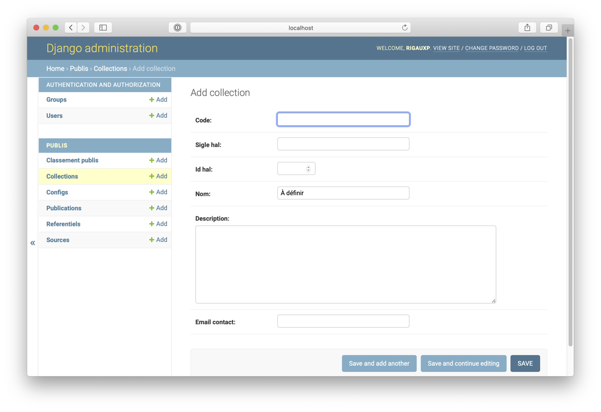
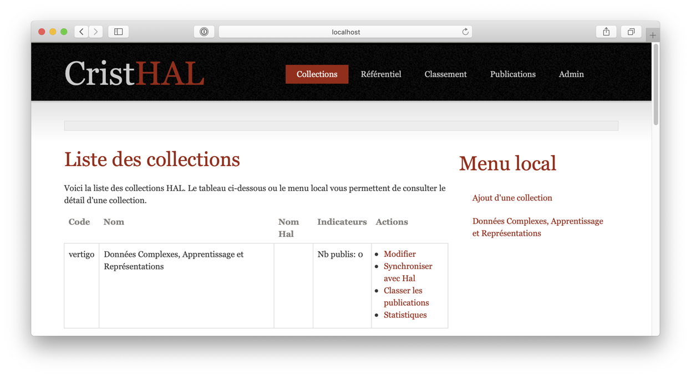

.. _chap-collections:

#######################
Gestion des collections
#######################

CristHAL récupère pour les analyser des collections de publications appartenant à une *structure*
HAL. Chaque structure a un nom (par exemple CEDRIC-VERTIGO pour l'équipe VERTIGO du Cédric) 
et un identifiant (par exemple 553459 pour cette même équipe). Le 
lien https://aurehal.archives-ouvertes.fr/structure/browse?critere=cedric&category=*
donne par exemple la liste des structures (équipes en l'occurrence) du laboratoire
Cédric.

.. note:: Reportez-vous à la documentation https://doc.archives-ouvertes.fr/gerer-un-portail/referentiels/structures-de-recherche/ 
          pour des informations sur la notion de structure de recherche dans HAL.

Pour demander l'analyse des publications d'une structure dans CristHAL, vous devez
d'avord la définir, puis la synchroniser avec HAL.

.. important:: L'ensemble des publications d'une structure est une *collection* dans CristHAL.

***************************
Définition d'une collection
***************************

Depuis la page d'accueil, suivez dans le menu local le choix 'Ajouter une collection'. On obtient le
formulaire de la :numref:`creer-collection`.

.. _creer-collection:

   
        Création d'une collection

Les données sont les suivantes

  - Code : un code (unique) CristHAL pour faire référence à la collection (par exemple l'acronyme de l'équipe)
  - Sigle HAL : le sigle de la structure dans HAL (unique)
  - Id HAl: identifiant de la structure dans HAL (unique)
  - Nom : un texte bref utilisé pour les affichages (par exemple le nom de l'équipe)
  - Description : texte libre
  - Email contact: adresse de la personne-contact pour la collection

Vous pouvez revenir à tout moment sur la collection pour la modifier via l'interface d'administration.

************************
Synchronisation avec HAL
************************

Les collections apparaissent dans un tableau sur la page d'accueil (:numref:`page-collections`).

.. _page-collections:

   
        Page des collections (accueil)

Les actions possibles sont:
  
   - la modification
   - la synchronisation avec HAL
   - le classement des publications (voir plus loin)
   - la consultation des statistiques (également accessible dans le menu local)

La synchronisation permet de récupérer les publications de la structure HAL et de les
insérer dans la collection (ou de les mettre à jour si elles existent déjà). Cette opération
doit être effectuée régulièrement pour maintenir la collection en phase avec HAL. 

.. note:: Seules les publications de la période configurée sont chargées. De même, ChristHAL
   charge un sous-ensemble des types de publication HAL (les REPORT, AUTRE et UNDEFINED sont ignorées).

****************
Les publications 
****************

le menu
